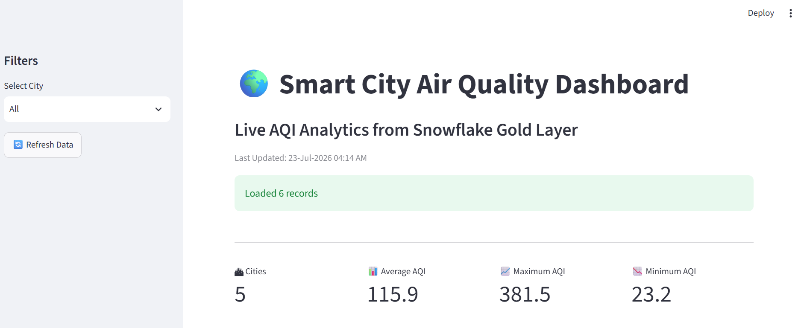

# 🌍 Smart City Air Quality Analytics Pipeline


> 🚀 An end-to-end Data Engineering project using Python, Snowflake, Apache Airflow, Streamlit, Plotly, Docker, and OpenAQ API.

An end-to-end Data Engineering project that collects air quality data from multiple sources, processes it using ETL, stores it in Snowflake, automates workflows with Apache Airflow, and visualizes insights using an interactive Streamlit dashboard.

---

# 📌 Project Overview

This project simulates a real-world Smart City Air Quality Monitoring System.

The pipeline collects data from:

- 🌐 OpenAQ API
- 📡 IoT Sensor Simulator

The data passes through a Medallion Architecture:

Bronze → Silver → Gold

Finally, an interactive Streamlit dashboard displays AQI trends, city comparisons, maps, and analytics.

---

# 🏗️ Project Architecture

```

OpenAQ API
│
├──────────────┐
│
IoT Simulator
│
▼
Bronze Layer (RAW)
│
▼
Silver Layer (CLEAN)
│
▼
Gold Layer (ANALYTICS)
│
▼
Apache Airflow
│
▼
Streamlit Dashboard

```

---

# 🛠 Technologies Used

| Technology | Purpose |
|------------|----------|
| Python | ETL Development |
| Snowflake | Cloud Data Warehouse |
| Apache Airflow | Workflow Automation |
| Streamlit | Dashboard |
| Plotly | Interactive Charts |
| Pandas | Data Processing |
| OpenAQ API | Air Quality Data |
| Docker | Airflow Deployment |
| Git & GitHub | Version Control |

---

# 📂 Project Structure

```
Smart-City-AQI/
│
├── dashboard.py
├── etl_pipeline.py
├── first_dags.py
├── iot_simulator.py
├── openaq_data.py          
├── requirements.txt
├── .gitignore
├── README.md
├── .env
│
├── iot_readings.csv
├── openaq_readings.csv
│
└── screenshots/
    ├── dashboard.png
    ├── highlights.png
    ├── gauge.png
    ├── average_aqi.png
    ├── max_aqi.png
    ├── pie_chart.png
    ├── map.png
    └── city_table.png

---

# ⚙️ ETL Pipeline

## Bronze Layer

Stores raw data from:

- IoT Sensors
- OpenAQ API

No transformations are applied.

---

## Silver Layer

Data Cleaning:

- Remove duplicates
- Handle missing values
- Convert timestamps
- Standardize schema
- Calculate AQI
- Categorize AQI

---

## Gold Layer

Creates business-ready aggregated tables including:

- Average AQI
- Maximum AQI
- Minimum AQI
- PM2.5 Statistics
- CO₂ Statistics
- Dominant Health Risk
- Daily Reports

---

# 📊 Dashboard Features

The Streamlit dashboard provides:

✅ KPI Cards

- Number of Cities
- Average AQI
- Maximum AQI
- Minimum AQI

---

✅ Interactive Charts

- Average AQI Bar Chart
- Maximum AQI Line Chart
- AQI Distribution Pie Chart
- AQI Gauge Chart

---

✅ Pakistan AQI Map

Interactive Plotly Map displaying:

- City Locations
- AQI Levels
- Hover Information

---

✅ Sidebar Filters

- Filter by City
- Refresh Dashboard

---

✅ Download Feature

Export dashboard data as CSV.

---

# 📈 Sample Dashboard




---

# 🗺 Pakistan AQI Map


---

# 🔄 Airflow DAG

The ETL workflow is automated using Apache Airflow.

Tasks include:

1. Fetch OpenAQ Data
2. Generate IoT Data
3. Clean Data
4. Load into Snowflake
5. Update Gold Layer

---

# 📦 Installation

## Clone Repository

```bash
git clone https://github.com/yourusername/Smart-City-AQI.git

cd Smart-City-AQI
```

---

## Create Virtual Environment

```bash
python -m venv .myvenv
```

Activate

Windows

```bash
.myvenv\Scripts\activate
```

Linux

```bash
source .myvenv/bin/activate
```

---

## Install Packages

```bash
pip install -r requirements.txt
```

---

## Configure Environment Variables

Create a `.env` file.

```env
SNOWFLAKE_ACCOUNT=xxxx
SNOWFLAKE_USER=xxxx
SNOWFLAKE_PASSWORD=xxxx
SNOWFLAKE_WAREHOUSE=xxxx
SNOWFLAKE_DATABASE=SMART_CITY_AQI

OPENAQ_API_KEY=xxxxxxxx
```

---

## Run ETL

```bash
python etl_pipeline.py
```

---

## Run Dashboard

```bash
streamlit run dashboard.py
```

---

# 📊 Snowflake Tables

## Bronze

- IOT_READINGS
- OPENAQ_RAW

---

## Silver

- AQI_CLEAN

---

## Gold

- CITY_DAILY

---

# 🚀 Future Improvements

- Real-time Streaming using Kafka
- Weather API Integration
- Machine Learning AQI Prediction
- Email Alerts
- Mobile Dashboard
- Historical Trend Analysis

---

# 👩‍💻 Developed By

**Aqsa Khan**

Data Engineering Project

Smart City Air Quality Analytics

---

# ⭐ If you found this project useful, consider giving it a star!
